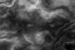

# Nito - A Difficult-To-Use 3D Game Engine

A simple 3D project where I learned 3D graphics principles, height maps, shaders and cameras.

The height map terrain class turns a gray scale images into a 3D object meshes. 

For example:

Turns into:

